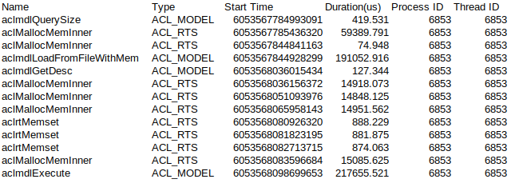
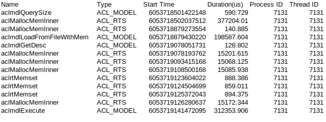

## Flash-Attention-Ascend
**FlashAttention Implementation based on Huawei Ascend 310.**

### Experiments
#### FlashAttention vs NormalAttention(batch16-n2048-d192)

##### Flash Attention acl Summary Result

##### Normal Attention acl Summary Result

#### Absolute Error(between Ascend Results and Numpy Results)
$$|e| < 0.001$$

[This link](https://github.com/dzcmingdi/flash-attention-ascend/releases/tag/v0.0.1) include all summary results.